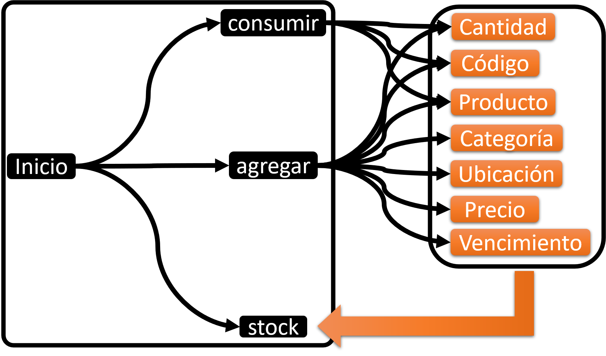
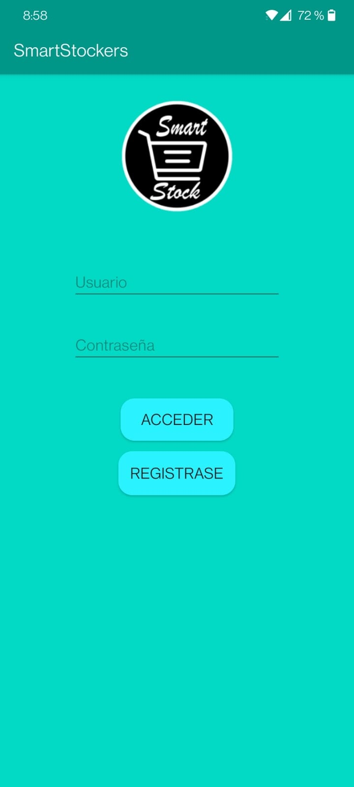

# Smart Stocking 📊
 
## Autores ✒️
* **Fernando Guillen**
* **Gerhard Freiberg**
* **Marcelo Zapata** 
* **Aaron Santamaria** 
 
## Descripción del proyecto 💬

El proyecto tiene como objetivo facilitar a los usuarios a que tengan el control y puedan recordar que productos tienen en sus hogares.

 
## Objetivos principales 📜
 
### Misión  📃
 
 
Nuestra misión es ofrecer un servicio de stocking para el hogar. Esta herramienta facilitara el facil acceso a una base de datos donde se estaran almacenando todos los productos que el cliente quiera agregar. Cabe resaltar que nuestro software tambien hace la visualizacion masiva de productos muy eficaz y amigable al usuario.
 
### Visión 👀
 
Nuestra vision es dejar de lado el papel y que todo el mundo pueda tener acceso a una herramienta sencilla para organizar objetos del hogar.

### Diagrama

 
## Tecnologias utilizadas 🛠️⚙️
 
* [SQLAlchemy](https://www.sqlalchemy.org/) - ORM Utilizado
* [Flask](https://flask.palletsprojects.com/en/2.0.x/) - Descripcion
* [Python](https://www.python.org/) - Lenguaje de programacion utilizado
* [HTML](https://devdocs.io/html/) - Markup Language utilizado
* [CSS](https://developer.mozilla.org/es/docs/Web/CSS) - Lenguaje de estilos utilizado

 
 
## Despliegue 💨
 
Ejecutar el archivo [app.py](https://github.com/Neo-Zapata/smart_stockers-copy/blob/master/app.py)
 
 
## Versionado 🗂️
 
Usamos [Flask Migrate](https://flask-migrate.readthedocs.io/en/latest/) para el versionado. Para todas las versiones disponibles, mira las [Versiones en este repositorio](https://github.com/Neo-Zapata/smart_stockers-copy/tree/master/migrations/versions).

## App Android

